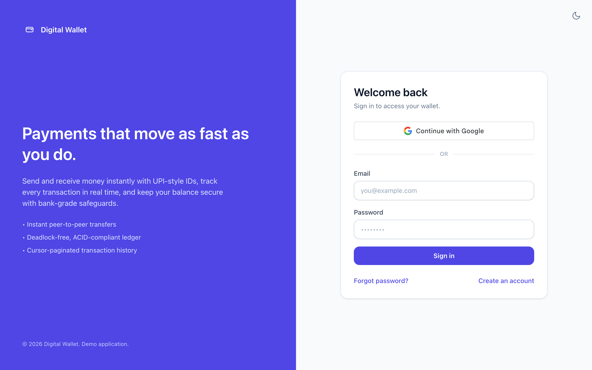
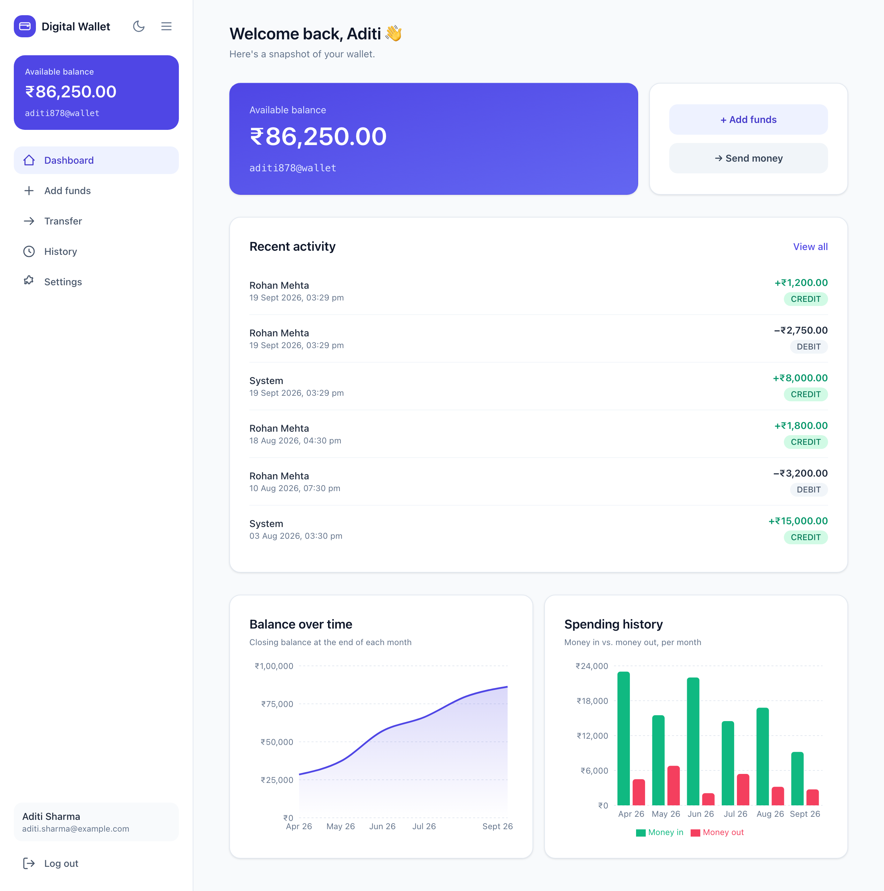
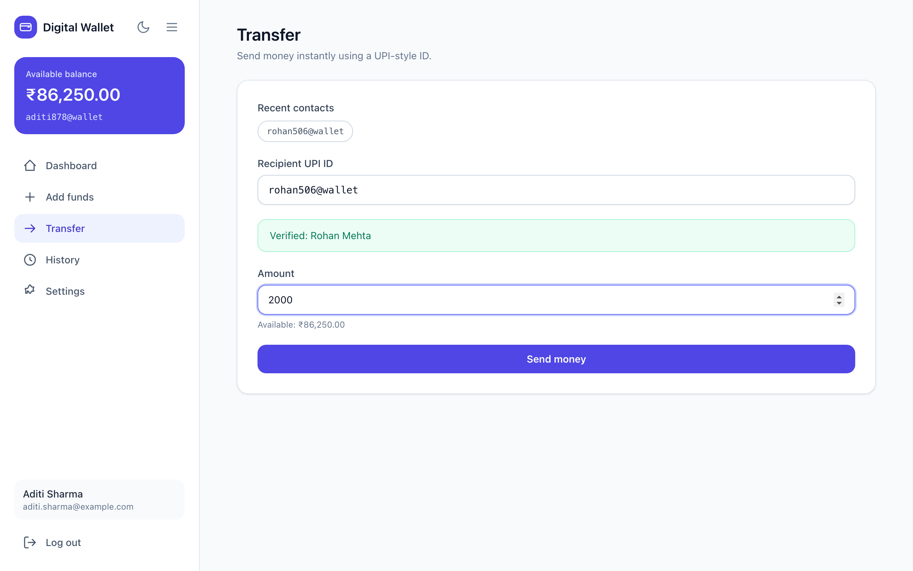
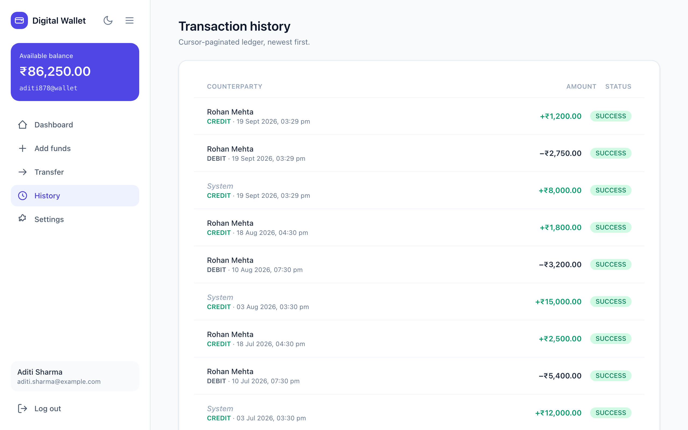
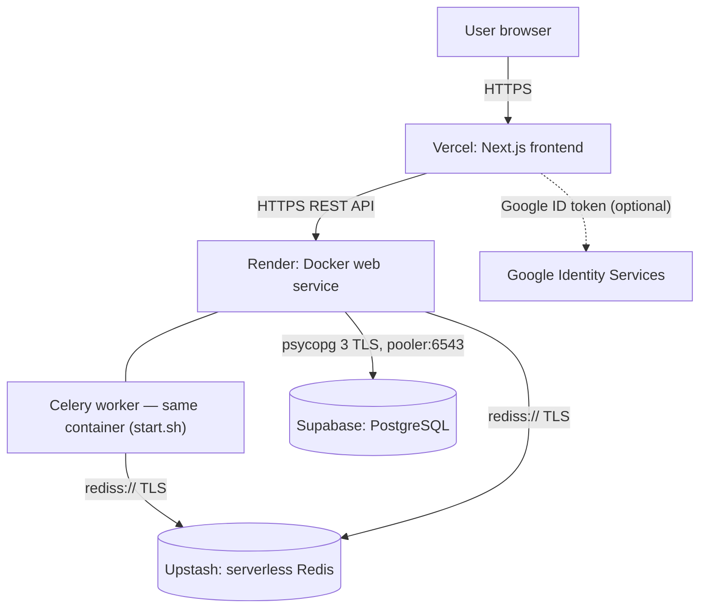
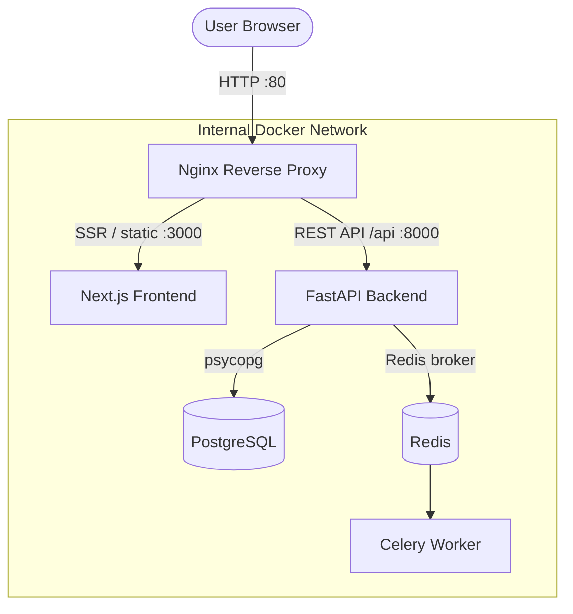
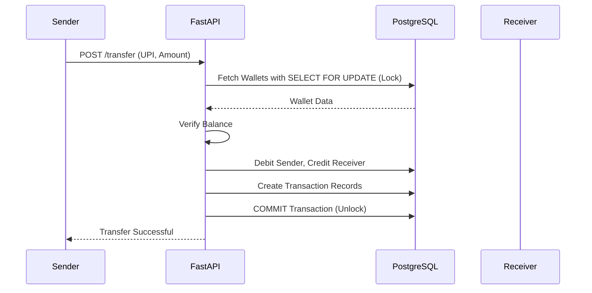

# Digital Payment Wallet

A highly scalable, asynchronous digital wallet application that supports secure peer-to-peer (P2P) transfers, user authentication, and deposit management. Built with FastAPI, PostgreSQL, and a Next.js (React) frontend, this app ensures safe financial transactions using strict row-level locking strategies to prevent race conditions and deadlocks.

## Screenshots

<!-- Add your screenshots to a folder named "assets" in the repository, then replace these placeholder images! -->

| Login & Registration | Interactive Dashboard |
|:---:|:---:|
|  |  |

| P2P Transfer & Add Funds | Transaction History |
|:---:|:---:|
|  |  |

## System Architecture

**Production** runs on a zero-cost managed stack with GitHub-driven continuous
deployment (see [`DEPLOYMENT.md`](DEPLOYMENT.md)):



**Local development** uses the Docker Compose stack — Nginx fronts the Next.js
frontend on `/` and the FastAPI backend on `/api`, with Postgres, Redis, and a
Celery worker as sibling containers:



### Safe Financial Concurrency
To safely handle hundreds of simultaneous money transfers without double-spending, the database enforces ACID compliance using strict row-level locking during transfers.



## Features
- **Authentication:** JWT login and registration (Bcrypt password hashing), password recovery/reset, change password and account deletion.
- **Sign in with Google (optional):** the official Google Identity Services button; the backend verifies the ID token server-side (no client secret involved). An existing password account with the same email is linked automatically. Fully opt-in — with no client ID configured, the button and endpoint stay inert. See [Google Sign-In](#google-sign-in-optional).
- **UPI-Style Discovery:** Discover receivers safely using a `username@wallet` style ID without exposing personal data.
- **Deadlock-Free P2P Transfers:** Guaranteed safe concurrent transactions via deterministic database locking.
- **Dashboard analytics:** monthly balance-over-time (area) and money in vs. out (grouped bar) charts, backed by `GET /transactions/{wallet_id}/analytics`.
- **Cursor Pagination:** High-performance Keyset pagination with infinite-scroll transaction history.
- **Responsive, themeable UI:** light / dark / system theme; a desktop sidebar that is pinned to the viewport and collapses to an icon rail (preference remembered); on phones a sticky top bar with an animated slide-in drawer and a hamburger that morphs into a cross.
- **Service-Oriented Architecture:** Includes Redis and Celery for asynchronous background task processing.
- **Containerized local dev:** Full stack via Docker Compose behind Nginx.
- **Distributed free-tier deploy:** Vercel + Render + Supabase + Upstash, CI/CD from GitHub.

## Tech Stack
- **Backend:** FastAPI, Python 3.12, SQLAlchemy 2.0, psycopg 3 (async), Celery, `google-auth` (ID-token verification)
- **Database / Cache:** PostgreSQL 15, Redis
- **Frontend:** Next.js 14 (App Router), React 18, TypeScript, Tailwind CSS, Recharts, Google Identity Services
- **Testing / CI:** Playwright end-to-end suite, GitHub Actions (lint, typecheck, build, E2E against the Docker stack)
- **Local infra:** Docker, Nginx
- **Hosting:** Vercel (frontend), Render (API + worker in one Docker service), Supabase (Postgres), Upstash (Redis)

## API Overview
Interactive docs (Swagger) are served at `/docs`.

| Area | Endpoints |
| --- | --- |
| Auth | `POST /auth/login`, `POST /auth/google`, `POST /auth/recover`, `POST /auth/reset-password`, `POST /auth/change-password` |
| Users | `POST /users/`, `GET /users/{user_id}`, `DELETE /users/me` |
| Wallets | `GET /wallets/user/{user_id}`, `GET /wallets/lookup/{upi_id}` |
| Transactions | `POST /transactions/transfer`, `POST /transactions/add_funds/{wallet_id}`, `GET /transactions/{wallet_id}/history` (cursor-paginated), `GET /transactions/{wallet_id}/analytics?months=6`, `GET /transactions/{wallet_id}/contacts` |

## Local Setup

### With Docker (full stack)
1. Clone the repository.
2. Run `docker compose up -d --build`.
3. Open the app at `http://localhost` (Nginx serves the frontend on `/` and the API on `/api`).
4. The API (with Swagger Docs) is at `http://localhost:8000/docs`.

### Frontend only (development)
```bash
cd frontend
cp .env.example .env.local   # optional; defaults work against a local API on :8000
npm install
npm run dev                  # http://localhost:3000
```
The dev server proxies `/api/*` to `API_PROXY_TARGET` (default `http://localhost:8000`).

### Testing
```bash
docker compose up -d --build          # the E2E suite runs against the full stack
cd frontend
npm run test:e2e                      # Playwright (auth, transfers, history, theme, sidebar, charts)
npm run lint && npm run typecheck     # static checks (also run in CI)
```
CI (`.github/workflows/ci.yml`) runs the static checks and the Playwright suite on every push. Google sign-in itself needs a live Google account and can't be scripted, so the suite only asserts that the button is absent when no client ID is configured.

## Google Sign-In (optional)
Off by default. To enable it, create a **Web application** OAuth client in Google Cloud Console (use a project dedicated to this app — the name on Google's consent screen comes from the project that owns the client ID), then set the same client ID in both places:

| Where | Variable | Notes |
| --- | --- | --- |
| Backend (Render / shell) | `GOOGLE_CLIENT_ID` | Tokens are verified against this audience |
| Frontend (Vercel / `frontend/.env.local`) | `NEXT_PUBLIC_GOOGLE_CLIENT_ID` | Baked in at build time — redeploy (or restart `npm run dev`) after changing it |

Add every origin the frontend is served from (e.g. `http://localhost:3000`, your Vercel URL) to the client's **Authorized JavaScript origins**. No redirect URI or client secret is needed.

> **Existing databases need a one-off migration *before* the new code is deployed.** `create_all` never alters existing tables, so a database that predates this feature must add the new `users` columns first, or every request that loads a user (including plain login) fails with `UndefinedColumn`. Run `alter_db_google_auth.py` against the database, or paste its four `ALTER TABLE` statements into the Supabase SQL Editor inside a `BEGIN; … COMMIT;`. Details and the exact SQL are in [`DEPLOYMENT.md`](DEPLOYMENT.md#5-google-sign-in-optional). A fresh local Docker volume needs nothing.

## Deployment
Production is a zero-cost managed stack (Vercel, Render, Supabase, Upstash) with
continuous deployment from GitHub. Full step-by-step instructions:
[`DEPLOYMENT.md`](DEPLOYMENT.md).

- Backend config is entirely environment-driven — `DATABASE_URL`, `REDIS_URL`,
  `FRONTEND_ORIGINS`, `SECRET_KEY`, and optionally `GOOGLE_CLIENT_ID` (see
  [`app/core/config.py`](app/core/config.py) and [`.env.example`](.env.example)).
- The root `Dockerfile` + `start.sh` run the API and Celery worker (solo pool)
  in one free Render Web Service, with `SIGTERM` handling for clean shutdowns.
- `render.yaml` is the Render Blueprint.
